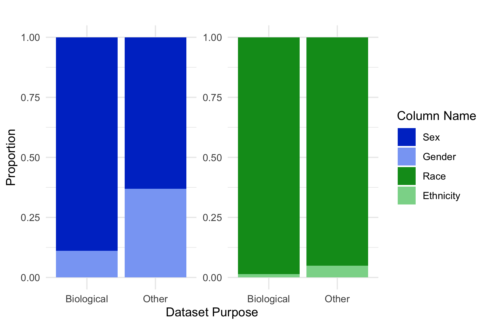

<link rel="stylesheet" href="styles.css" type="text/css">

# Projects

 

### A Grammar for Hypothesis Testing in the Tidyverse

*September 2019 -- Present*

 I work with Dr. Andrew Bray on the R package [infer](https://github.com/tidymodels/infer), providing a framework for hypothesis testing in the R *tidyverse* setting. More specifically, I work on fixing bugs, improving documentation (including help-files and vignettes), increasing testing coverage, and writing more informative error messages with the goal of the making the package more accessible and inclusive of all potential users.

 

 

 

 

### General Bikeshare Feed Specification (R Package)

*January 2018 -- Present*

 My collaborator Kaelyn Rosenberg and I initially built this tool as a class project in Data Science (MATH 241) at Reed College in Spring 2018. The [CRAN-published](https://cran.r-project.org/web/packages/gbfs/gbfs.pdf) R Package makes use of a standardized data format used by hundreds of bikeshare programs worldwide for releasing live information feeds on bikeshare dock station and bike information (e.g. the location of docks, current location of bikes on the road, number of available docks at a given dock, etc.) to provide a set of functions to easily query these .json feeds and convert them to tidy R datasets. Source code for that project can be found [here](https://github.com/ds-civic-data/gbfs)!

 

 

### Gendering Documentation

*September 2019 -- Present*  

Beginning as a term paper for Gender & Work (SOC 322) in Fall 2019, this project focuses on code documentation practices within R development communities. Through interviews with women in the field, as well as quantitative analyses utilizing web scraping and text mining methods, I argue that code documentation in the tidyverse is written more effectively and inclusively than other R code documentation, and that this is meaningful for understanding gender representation in the user community. R source code and paper drafts are available [here](https://github.com/simonpcouch/gendering_documentation)! This project is advised by Dr. Kjersten Whittington.   

### Social Divisions in Data

*September 2019 -- December 2019*  

 This project was a term paper for Science and Social Difference (SOC 326) in Fall 2019. I argue that, rather than viewing datasets as unargumentative, sterile, or "raw," datasets express and reinforce the social conceptualizations held by their authors. More specifically, in this paper, I examine how sex, gender, race, and ethnicity are named and encoded as variables in data, and how this process is patterned by identities held by the datasets’ authors. R source code and the final paper are available [here](https://github.com/simonpcouch/social_divisions_in_data)! This project was advised by Dr. Kjersten Whittington.   

 

### Equity of Bikeshare Programs  

*October 2018 -- September 2019*

 Beginning as a final class project for Statistical Learning (MATH 243) at Reed College in Fall 2018, this research project focused on making use of machine learning methods to quantify progress in equity of bikeshare programs in the United States. Making use of [my R package gbfs](https://github.com/ds-civic-data/gbfs) to scrape latitude/longitudes of over 45,000 bikes across the country and joining that data with census demographic data, the project set out to determine the features of a community that are most salient in understanding the spatial distribution of bikes, and how these interact with different operating models of the programs. A preliminary report on this research [tied for second place](https://www.causeweb.org/usproc/usresp/2019/spring/winners) in the ASA-sponsored "Undergraduate Statistics Research Competition." A pre-print of further work on this project is currently in review, and a pre-print is available [here](https://arxiv.org/abs/1906.00129v1).

 

### Differentially Private Hypothesis Testing  

*May 2018 -- July 2019*

 The summer after my first year at Reed, I worked full-time in a research group on database privacy. In particular, we focused on the potential of nonparametric approaches to differentially private hypothesis testing. Differential privacy is a subfield of database anonymization where researchers can access sensitive information in a database (e.g. medical records) by sending a query (in our case, to run a hypothesis test) and being returned a privatized output (in our case, a noisy test statistic). An early report on the research, "A Differentially Private Wilcoxon Signed-Rank Test", [tied for 1st prize](https://www.causeweb.org/usproc/usresp/2018/fall/winners) in the ASA-sponsored "Undergraduate Statistics Research Competition," and our [final report](https://dl.acm.org/citation.cfm?id=3339821) on this work, for which I am primary author, was published in the Proceedings of the 2019 ACM Conference on Computer and Communications Security! All R source code implementing our algorithms is freely available [here](https://github.com/simonpcouch/non-pm-dpht).

 

### An Alternative to Rankings-Based College Exploration 

*January 2019 -- May 2019*

 This was a project completed for Statistics Practicum (MATH 343) at Reed College in Spring 2019 with [EJ Arce](https://github.com/ejarce) and [Alexander Moore](https://github.com/moorea1). In this work, we argued that newsmagazine college rankings like those provided by U.S. News are both unhelpful for prospective students and reinforce existing status obsession. As an alternative, we developed a data-centered tool that focuses on what makes a college similar to, not better than, another college. Data from IPEDS and the Mobility Report Card from the Equality of Opportunity Project were joined and provided to users in an R Shiny application that allows users to compare United States educational institutions through visualization, comparison of raw data, and model-based assessment of school similarity. That application is hosted live [here](https://shiny.reed.edu/s/users/couchs/colleges/), with source code and a copy of our final paper [here](https://github.com/simonpcouch/College-Exploration).

 

### anyflights (R Package, no longer supported)

*December 2017 -- December 2018*

This R package, inspired by the well-known [nycflights13](https://github.com/hadley/nycflights13) data-only R package, supplies a set of functions to query air travel data. The main wrapper function, *anyflights*, grabs data for a user-given year and airport and returns a folder of tidied datasets with identical formatting to that in *nycflights13*. The thought was to allow for students learning the basics of R and the tidyverse through labs working with the *nycflights13* package to work with more recent data from their own hometowns or from the airport closest to their school. An instructor could use this package to generate a folder of data (~5MB) that could be distributed to students through Dropbox, GitHub, etc. As a result, students could make discoveries that could impact their own, real-life air travel decisions. The formatting and querying structure of the data changed very often, though, and I decided to stop maintaining the package in late 2018. The source code for this project can be found [here](https://github.com/simonpcouch/anyflights)--let me know if you're interested in maintaining this package!
